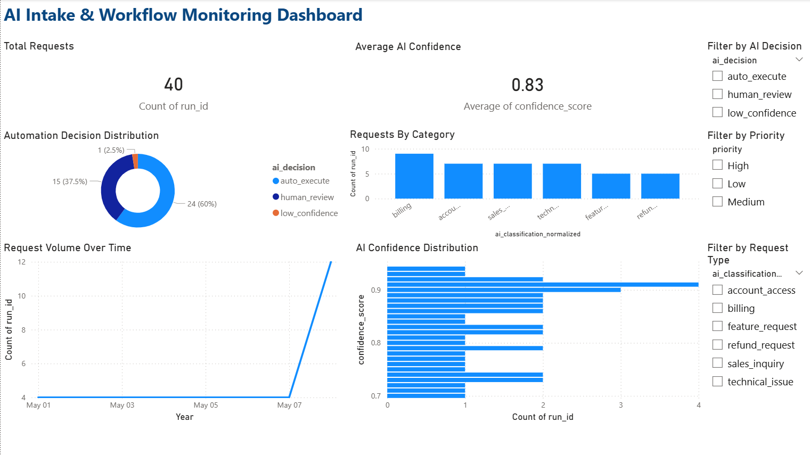

# AI Intake & Workflow Monitoring Dashboard

## Overview

This project demonstrates how AI-powered workflows can be monitored using business intelligence tools. The dashboard tracks AI request volume, confidence levels, automation decisions, and workflow categories to provide operational visibility into an automated intake and triage system.

The goal of this project is to simulate how companies monitor AI-driven workflows in production environments.

The dashboard was built using **Power BI** with sample workflow data generated from an AI automation pipeline.

---

## Dashboard Preview



---

## Key Metrics Monitored

### Operational Metrics

* **Total Requests** – total number of intake submissions processed
* **Average AI Confidence** – average confidence score of AI classifications

### AI Decision Monitoring

* **Auto Execute** – requests automatically processed
* **Human Review** – requests routed to manual review
* **Low Confidence** – AI responses requiring investigation

### Workflow Insights

* **Requests by Category**
* **Request Volume Over Time**
* **AI Confidence Distribution**

### Interactive Filters

The dashboard allows filtering by:

* AI Decision
* Priority
* Request Category

This allows teams to quickly investigate workflow behavior and AI performance.

---

## Tools Used

* **Power BI Desktop**
* **Google Sheets**
* **CSV dataset**
* **AI workflow data**

---

## Project Files

```text
ai-intake-workflow-monitoring-dashboard
│
├── README.md
├── ai-intake-triage-dashboard-overview.png
├── ai-intake-triage-workflow-monitoring-dashboard.pbix
└── AI Intake Triage Sample Dataset - Sheet1.csv
```

---

## Download Dashboard

You can download the Power BI dashboard here:

[Download Power BI Dashboard](ai-intake-triage-workflow-monitoring-dashboard.pbix)

---

## Download Dataset

Sample dataset used in the dashboard:

[Download Sample Dataset](ai-intake-triage-sample-dataset-sheet1.csv)

---

## How to Run This Project

1. Download the `.pbix` file
2. Open it using **Power BI Desktop**
3. Load the dataset if prompted
4. Explore the interactive dashboard and filters

---

## Related Project

This dashboard monitors the automation workflow built in the project:

**AI Intake & Triage Automation System**

The automation pipeline processes incoming requests using AI and routes them based on classification confidence.

---

## Author

Dennis Hanton | AI Automation Engineer
